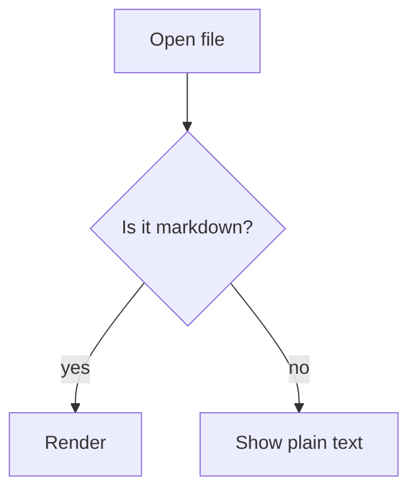

# Markdown Viewer

A browser-based Markdown reading environment with ChatGPT-quality rendering, multi-file tabs, and calm, polished UX.

## Features

- **Beautiful Markdown Rendering** — ChatGPT-inspired typography and layout
- **Multi-File Tabs** — Open multiple Markdown files as browser-style tabs
- **Scroll Memory** — Each tab remembers where you were when you switch away
- **Drag & Drop** — Drop `.md` files anywhere to open them
- **Syntax Highlighting** — Code blocks with language detection and copy button
- **Math Rendering** — LaTeX/KaTeX support for mathematical notation
- **Diagram Rendering** — Mermaid diagrams with zoom, pan, and full-screen view
- **Dark/Light Mode** — Theme toggle with system preference detection
- **Responsive Design** — Works on desktop, tablet, and mobile
- **GFM Support** — Tables, task lists, strikethrough, and more
- **Privacy First** — All processing happens in the browser, no server required

## Getting Started

```bash
# Install dependencies
npm install

# Start development server
npm run dev

# Build for production
npm run build

# Preview production build
npm run preview
```

## Tech Stack

- React 18
- TypeScript
- Vite
- Tailwind CSS
- react-markdown
- remark-gfm
- remark-math
- rehype-raw
- rehype-sanitize
- rehype-highlight
- rehype-katex
- mermaid
- highlight.js
- KaTeX
- DOMPurify
- lucide-react

## Diagrams

Fenced `mermaid` blocks render as interactive diagrams:

````markdown

````

- Drag to pan, or focus the diagram and use the arrow keys
- `Ctrl`/`Cmd` + scroll, or pinch, to zoom. Plain scrolling still scrolls the page
- `+` / `-` / `0` / `f` for zoom in, zoom out, reset and fit-to-width
- Double-click to reset
- The toolbar offers zoom, fit-to-width, copy source, download as SVG, and a full-screen view

Diagrams follow the active theme, including light and dark variants. A diagram that fails
to parse shows the error and its source rather than disappearing.

Mermaid is loaded on demand, so documents without diagrams never download it.

## Security

All processing happens in the browser. Markdown is rendered with `rehype-raw` enabled, so
raw HTML embedded in a document is a real attack surface:

- Raw HTML is sanitized by `rehype-sanitize` before it reaches the DOM, so `<script>`,
  event-handler attributes such as `onerror`/`onclick`, and `<style>` elements in a
  document are neutralised
- Rendered diagram SVG is sanitized separately by DOMPurify
- Mermaid itself runs at `securityLevel: 'strict'`

`<iframe>` is deliberately not permitted in documents.

## Usage

1. Open the application in your browser
2. Drag and drop `.md` files or click "Choose Files"
3. Each file opens in a new tab
4. Switch between tabs to read different documents
5. Toggle dark/light mode with the theme button

## License

MIT
